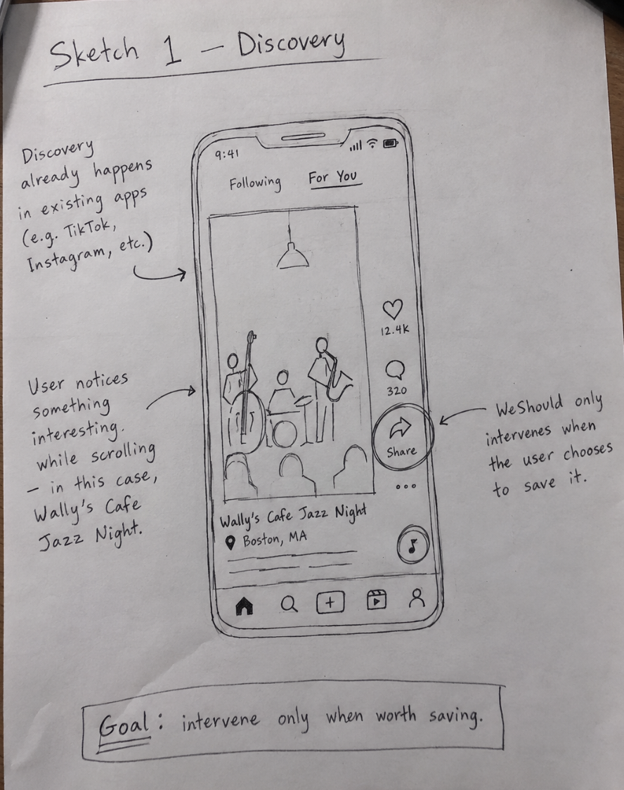
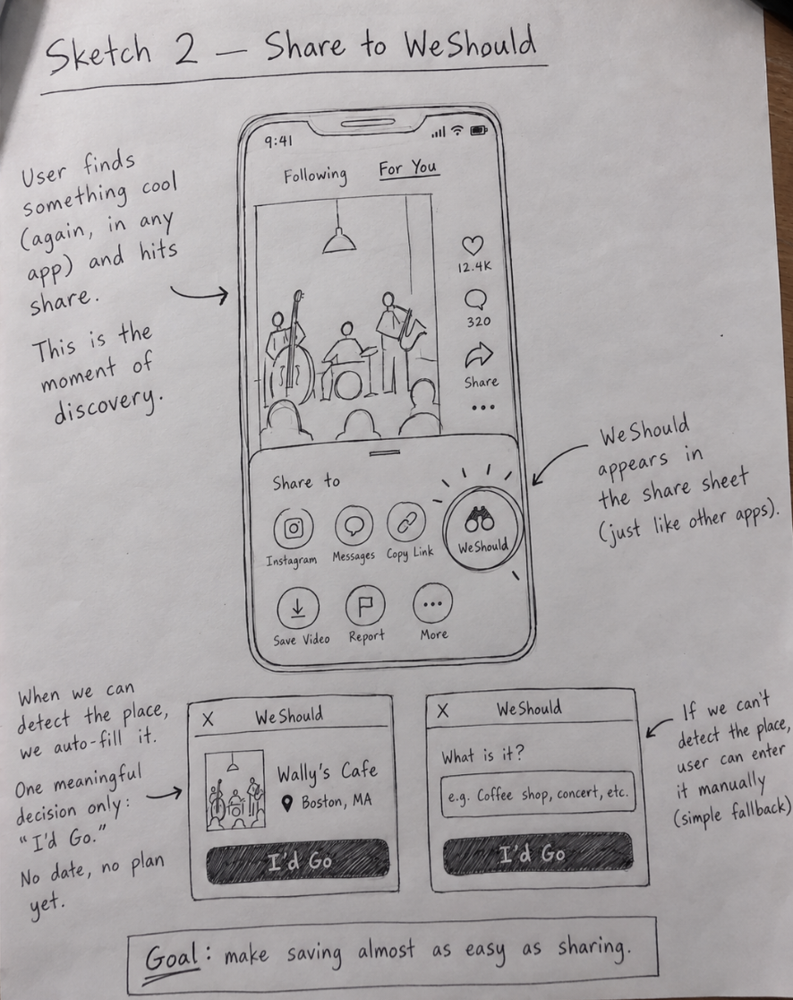
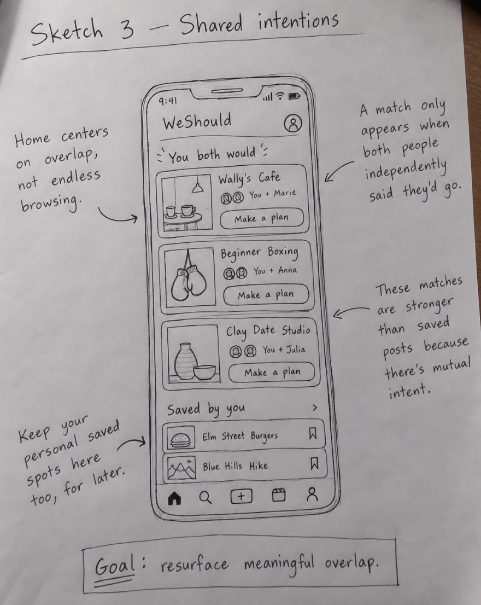
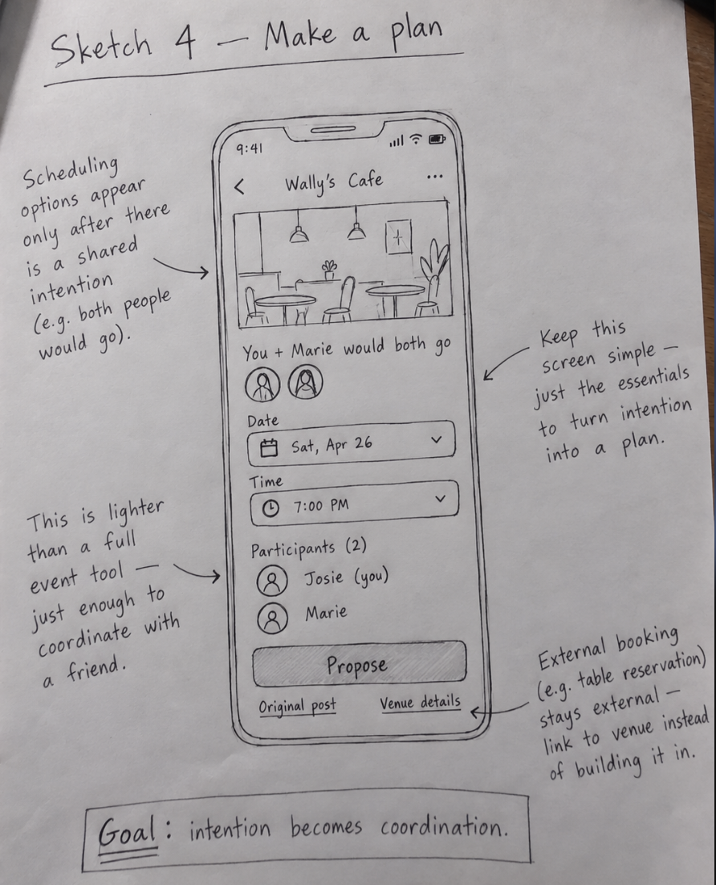
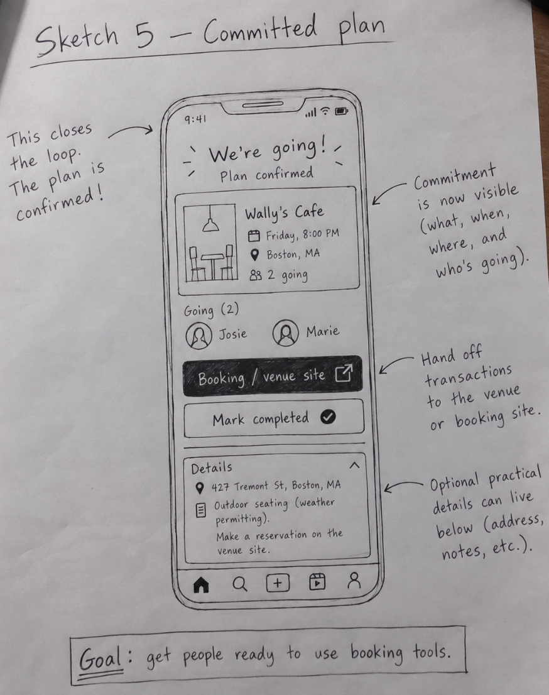

# UI Sketches

(In the sketches folder which can be found in the general images folder)
---

## Sketch 1: Discovery

The user encounters an activity while scrolling in an app they already use. In this example, Josie sees a post about **Wally's Cafe Jazz Night** in Boston.

The important interaction is the existing **Share** action. WeShould doesn't try to replace TikTok, Instagram, or other discovery platforms with another feed. It intervenes only when the user decides that something is worth preserving.

**Key design point:** discovery already works. WeShould begins at the moment the user thinks, *I would actually do this*.

---

## Sketch 2: Share to WeShould

The user taps the normal Share action in the original app. **WeShould appears as a destination in the system share sheet** alongside other applications.

When the shared content can be identified, the WeShould extension pre-fills a lightweight activity card. In the sketch, it recognizes **Wally's Cafe** and **Boston, MA**. The user then makes one decision:

> **I'd Go**

No date, invitation, or plan is required yet.

The sketch also shows the fallback case. If WeShould cannot identify the activity automatically, the user can enter a short description manually and still tap **I'd Go**. Automatic extraction reduces friction when it succeeds without becoming a requirement for the core workflow.

**Key design point:** saving an intention should be almost as easy as sharing the original post.

---

## Sketch 3: Shared Intentions

The WeShould home screen centers on **shared intention**, not another stream of recommendations.

The **You both would** section contains activities for which the current user and a connection have independently expressed willingness. The sketch shows examples such as:

- **Wally's Cafe** — You + Marie
- **Beginner Boxing** — You + Anna
- **Clay Date Studio** — You + Julia

Each shared intention can be escalated with **Make a plan**.

A smaller **Saved by you** section preserves unmatched personal intentions, such as a restaurant or hike the user still wants to remember. Those items remain available without being presented as social matches.

**Key design point:** a match means more than a saved post because two people have independently indicated that they would actually go.

---

## Sketch 4: Make a Plan

Scheduling appears only after shared willingness already exists.

For **Wally's Cafe**, the screen reminds Josie that she and Marie both said they would go. Josie can then choose a date and time, see the intended participants, and press **Propose**.

The screen deliberately stays lighter than a full event-management or calendar tool. It asks for only the information necessary to turn a shared intention into a concrete proposal.

Links to the **Original post** and **Venue details** remain available. Reservations, ticket purchases, and other transactions stay on the external services already designed to handle them.

**Key design point:** this is the moment where intention becomes explicit coordination.

---

## Sketch 5: Committed Plan

Once the participants agree, the proposal becomes a visible commitment.

The confirmed-plan screen summarizes the activity, time, location, and people going. In the sketch, Josie and Marie are both shown as participants in the Wally's Cafe plan.

A **Booking / venue site** action hands any transaction off to the appropriate external service. The screen can also hold small practical details, such as an address or note, without turning WeShould into a reservation platform.

After the activity happens, the user can choose **Mark completed**, closing the loop on the intention that originally began with **I'd Go**.

**Key design point:** WeShould does not replace ticketing or reservations. It gets people to the point where they are ready to use those tools.

---
## Note: The additional pngs in the images folder are some figma prototypes I was working on. Though they're not complete/not direct representations of the original sketches, I thought it would be fun to visualize what the app could actually look like :)
